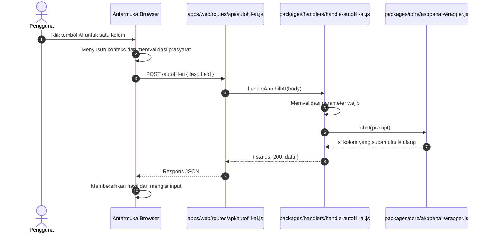
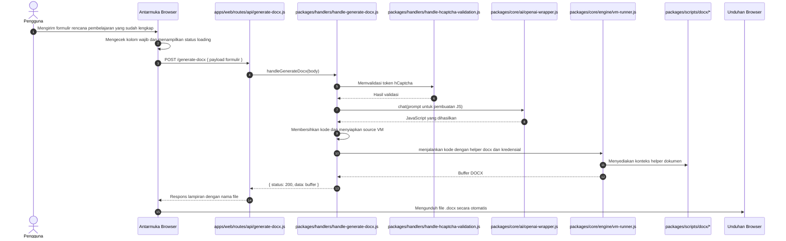

# Dokumen Kebutuhan Produk

## Gambaran Produk

Modul Ajar Generator adalah generator rencana pembelajaran untuk guru PAUD / usia dini. Produk ini membantu pendidik menyusun dokumen ajar yang terstruktur, memperbaiki setiap kolom formulir dengan bantuan AI, dan mengekspor hasil akhir sebagai file DOCX.

Implementasi saat ini berupa monorepo kecil dengan aplikasi web yang berjalan di browser, aplikasi API, handler bersama, utilitas inti bersama, dan pipeline pembuatan DOCX berbasis VM. Antarmuka browser dirender dari EJS, sedangkan pekerjaan utama ditangani oleh paket bersama dan prompt berbasis OpenAI.

## Pernyataan Masalah

Banyak guru PAUD mengalami kesulitan dalam menyusun rencana pembelajaran (RPP) karena kurangnya keahlian teknis dan literasi digital. Sebagian besar guru tidak terbiasa menggunakan komputer atau aplikasi kompleks, sehingga proses pembuatan dokumen menjadi beban tambahan. Produk ini dirancang untuk menjembatani kesenjangan keterampilan digital dengan antarmuka sederhana dan bantuan AI otomatis yang meminimalkan kebutuhan pengetahuan teknis.

## Tujuan

- Membuat proses pembuatan rencana pembelajaran dapat diakses oleh guru dengan tingkat literasi digital rendah.
- Menyediakan antarmuka yang intuitif dan sederhana tanpa memerlukan pengetahuan teknis mendalam.
- Menggunakan AI untuk mengotomatisasi tugas-tugas penulisan dan penyempurnaan konten agar guru dapat fokus pada perencanaan pedagogik.
- Menghasilkan dokumen DOCX berkualitas yang siap pakai tanpa perlu editing tambahan.
- Membangun kepercayaan pengguna melalui validasi yang jelas, umpan balik real-time, dan proses yang transparan.

## Bukan Tujuan

- Produk ini bukan editor dokumen serbaguna.
- Produk ini tidak ditujukan untuk menghasilkan dokumen arbitrer di luar domain rencana pembelajaran.
- Produk ini tidak membuka lapisan eksekusi VM sebagai lingkungan scripting untuk pengguna.

## Pengguna Utama

- Guru PAUD / usia dini dengan literasi digital rendah hingga sedang.
- Guru yang ingin menghemat waktu dalam penyusunan RPP berkualitas.
- Staf administrasi atau kepala sekolah yang membantu koordinasi penyusunan rencana pembelajaran.
- Pemelihara internal dan developer yang mengelola dan mengembangkan sistem.

## Perjalanan Pengguna

1. Pengguna membuka halaman utama dengan formulir yang terstruktur dan mudah dipahami.
2. Pengguna mengisi kolom-kolom sesuai panduan yang jelas, tanpa jargon teknis yang membingungkan.
3. Untuk setiap kolom, pengguna dapat mengklik tombol AI untuk mendapat saran konten tanpa harus menulis dari awal.
4. Pengguna mengirim formulir yang telah dilengkapi.
5. Sistem menampilkan status loading yang informatif sambil memproses di backend.
6. File DOCX hasil otomatis terunduh ke komputer pengguna dengan nama yang bermakna dan mudah dikenali.
7. Pengguna dapat segera menggunakan dokumen hasil tanpa perlu edit tambahan di Microsoft Word.

## Kebutuhan Fungsional

### Halaman Utama

- Aplikasi harus merender halaman utama dengan metadata runtime.
- Frontend harus menerima URL dasar API melalui nilai bootstrap yang dinormalisasi.
- Formulir harus mendukung kolom rencana pembelajaran yang dinamis, termasuk aktivitas per hari dan per JP.

### Autofill AI

- Pengguna harus dapat meminta bantuan AI untuk satu kolom tertentu.
- Client harus mengirim nilai kolom saat ini beserta konteks ke endpoint `/autofill-ai`.
- Backend harus memvalidasi permintaan dan hanya mengembalikan isi kolom yang sudah ditulis ulang.
- Browser harus membersihkan hasil AI lalu memasukkannya ke input tujuan.

### Pembuatan DOCX

- Pengguna harus dapat mengirim formulir lengkap untuk membuat dokumen akhir.
- Client harus mengirim `POST` payload formulir ke `/generate-docx`.
- Backend harus memvalidasi permintaan, menyusun prompt OpenAI, dan menghasilkan JavaScript untuk pembuatan dokumen.
- Kode yang dihasilkan harus dibersihkan dan dieksekusi di dalam sandbox VM.
- Server harus mengembalikan buffer DOCX dengan header lampiran agar browser mengunduhnya.

### Validasi dan Umpan Balik

- Kolom wajib harus diperiksa sebelum pembuatan dokumen dimulai.
- UI harus menampilkan status loading dan pesan error yang terlihat selama proses pembuatan.
- Sistem harus gagal secara aman jika OpenAI, hCaptcha, atau eksekusi VM mengalami kegagalan.

## Kebutuhan Teknis

- Aplikasi web harus mendukung URL dasar API eksternal atau mode API bawaan.
- Aplikasi API dan web harus memakai handler bersama untuk menghindari duplikasi logika bisnis.
- Pipeline pembuatan dokumen harus memakai `OpenAIWrapper` untuk akses model dan `VMRunner` untuk eksekusi sandbox.
- Utilitas bersama harus menangani validasi, ekstraksi kode, penghapusan import/require, perhitungan token, dan konversi angka Romawi.
- Middleware harus mencakup rate limiting, Helmet, dan proteksi CORS.
- Validasi hCaptcha harus ditegakkan sebelum DOCX dibuat.

## Batasan Utama

- Output OpenAI harus dianggap sebagai input tidak tepercaya sampai dibersihkan dan dijalankan di sandbox.
- Kode DOCX yang dihasilkan bergantung pada file konteks di `context/` dan modul helper di `packages/scripts/docx/`.
- Runtime yang sama harus mendukung pengembangan lokal dan pemisahan API bergaya deployment.

## Kriteria Sukses

- Pengguna dapat mengisi formulir dan menghasilkan file DOCX tanpa scripting manual.
- Autofill AI mengembalikan hasil satu kolom yang bisa langsung dimasukkan ke formulir.
- Dokumen yang dihasilkan otomatis terunduh dengan nama file yang bermakna.
- Kesalahan ditampilkan dengan jelas tanpa membocorkan detail implementasi internal kepada pengguna.

## Risiko

- Pergeseran prompt OpenAI dapat menghasilkan konten yang tidak sesuai skema yang diharapkan.
- Kegagalan eksekusi VM dapat menghentikan pembuatan dokumen walaupun prompt berhasil.
- Variabel lingkungan yang hilang atau salah dapat mencegah API maupun UI melakukan booting dengan benar.
- Payload formulir yang besar atau rusak dapat meningkatkan kegagalan request atau pembuatan dokumen.

## Diagram Urutan

### Autofill AI

### Pembuatan DOCX

## Catatan Implementasi

- Bootstrap halaman utama menormalkan `APP_API_BASE_URL` dan mengeksposnya ke skrip client.
- Aplikasi web dapat berjalan dengan API bawaan saat `APP_USE_BUILTIN_API=true` atau mengarah ke host API terpisah.
- Nama file dokumen yang dihasilkan diambil dari nama sekolah pada formulir yang dikirim.
- Utilitas CLI di `scripts/cli/` mendukung inspeksi arsip DOCX setelah pembuatan.

## Referensi

- [Codebase Overview](codebase-overview.md)
- [Runtime Flow](runtime-flow.md)
- [Shared Packages](shared-packages.md)
- [apps/web/index.js](../apps/web/index.js)
- [apps/api/index.js](../apps/api/index.js)
- [packages/handlers/handle-autofill-ai.js](../packages/handlers/handle-autofill-ai.js)
- [packages/handlers/handle-generate-docx.js](../packages/handlers/handle-generate-docx.js)